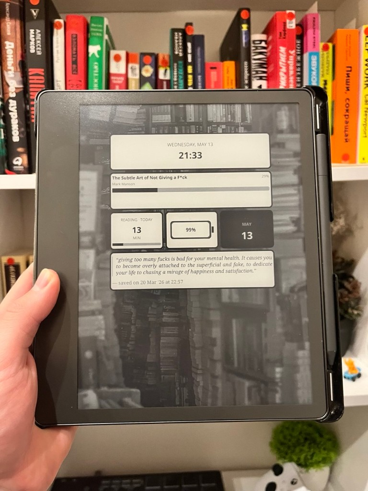

English | [Русский](README.ru.md)

# Awesome Sleepscreen

A [KOReader](https://github.com/koreader/koreader) plugin that replaces the default **sleep-screen banner** with a configurable **6×3 grid** of **widgets**—rounded **cards** in a Frame-like style. Each cell holds at most one widget; widgets can span **1–3 columns**. Included: clocks, templates, quotes from the book, sleep stats, date/time header, battery, current book, a calendar tile, and daily reading time.

## Features

- **6×3 grid** — Up to 18 slots; **horizontal span** 1–3 columns; row/column gutters configurable in banner appearance.
- **Widget types**
  - **Template** — Free text with KOReader-style placeholders (like the sleep-message editor).
  - **Sleep stats** — Default sleep text or a custom template.
  - **Quote** — A random saved quote from the current book (highlights).
  - **Digital clock** — Time formatted with `strftime`.
  - **Analog clock** — Analog dial with hands (tested on e-ink).
  - **Date & time header**, **Battery**, **Current book**, **Calendar tile**, **Reading time today** (statistics-based).
- **Near full-screen layout** — The grid uses the full screen area (over cover/wallpaper); outer containers have no fill, so the screensaver background shows between cards.
- **Localization** — English, Russian, and Chinese (simplified).

## KOReader settings (must all match)

The plugin grid appears only when **all** of the following are true:

1. **Sleep screen message** is enabled — in the reader (or file manager) open **Settings** → **Screen** → **Sleep screen**, then **Sleep screen message**, and turn **ON** **Add custom message to sleep screen**. (The Awesome Sleepscreen menu toggle only enables the plugin; it does **not** change these system settings.)
2. Message container mode is **Banner** — still under **Sleep screen message**, open **Container and position** and choose **Banner** (not **Box**).
3. **Screensaver type** is cover, **random image**, **document cover**, or **disabled** (so the standard banner region remains) — set under **Sleep screen** → **Wallpaper**.

If any of the above is wrong, KOReader shows its normal sleep message and the plugin does not replace it with the grid.

## Installation

1. Copy the plugin folder into KOReader’s `plugins` directory, for example:  
   `koreader/plugins/awesome-sleepscreen.koplugin/`
2. Restart KOReader and enable the plugin in the menu.
